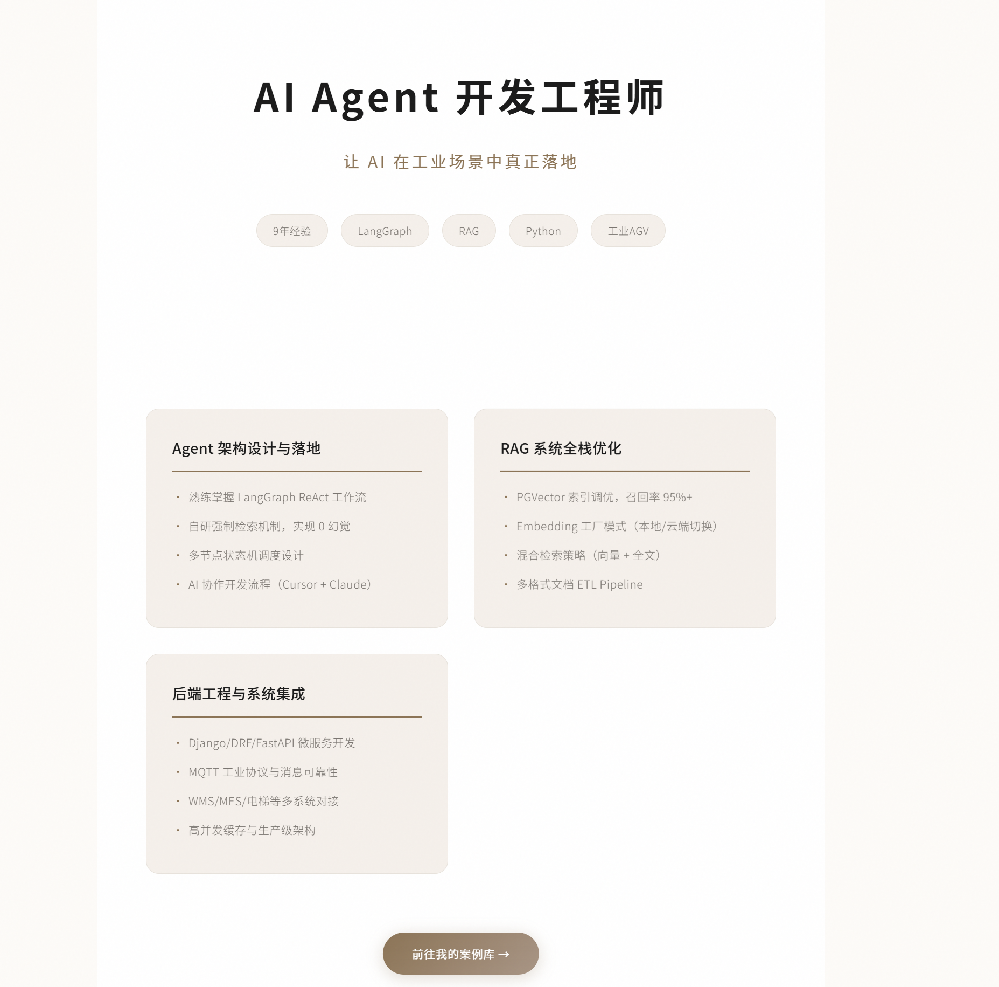
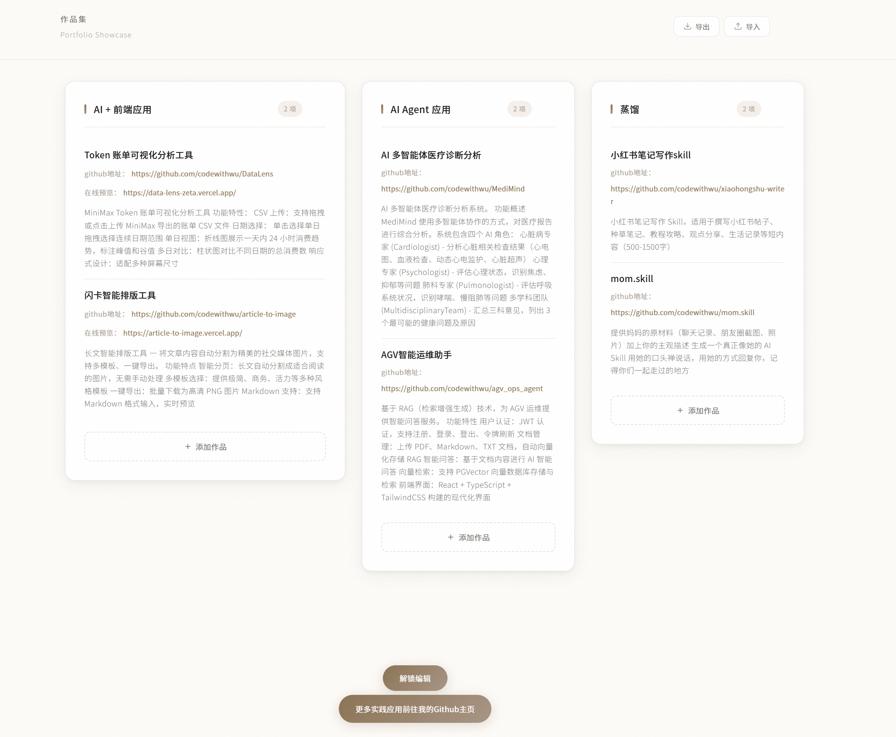

# Curated-Spaces

一个精致的作品集展示平台，采用温暖编辑美学风格设计。展示 AI Agent 开发工程师的核心技术能力与工业落地项目案例。

## 页面展示

### 首页 - 技术能力概览



### 案例库 - 项目展示



## 核心功能

- **首页展示**：简洁的技术能力概览，突出 Agent 架构、RAG 优化、后端工程等核心优势
- **案例库**：支持按类别筛选的项目展示页面（Agent应用 / RAG检索 / 后端架构）
- **密码保护**：管理后台可通过密码访问，支持新增和编辑内容
- **响应式设计**：适配多种屏幕尺寸，流畅的动画交互体验

## 技术栈

- **前端框架**：React + TypeScript + Vite
- **样式方案**：Styled-components（主题化设计系统）
- **路由**：React Router v6
- **动画**：CSS Keyframes + Cubic-bezier 缓动曲线

## 快速开始

```bash
# 安装依赖
npm install

# 开发模式
npm run dev

# 生产构建
npm run build
```

## 项目结构

```
src/
├── pages/
│   ├── HomePage.tsx      # 首页 - 技术能力概览
│   ├── PortfolioPage.tsx # 案例库 - 项目展示
│   └── EditPage.tsx      # 内容管理（需密码访问）
├── styles/
│   └── theme.ts          # 主题配置（颜色、圆角、阴影等）
└── components/           # 公共组件
```

## 定制说明

### 修改首页内容

编辑 `src/pages/HomePage.tsx` 中的 `IntroSection` 和 `AdvantagesSection` 组件。

### 添加项目案例

在 `src/pages/PortfolioPage.tsx` 的 `projectsData` 中添加新项目。

### 修改主题样式

编辑 `src/styles/theme.ts` 中的主题配置。

---

*Designed with warm editorial aesthetics.*
